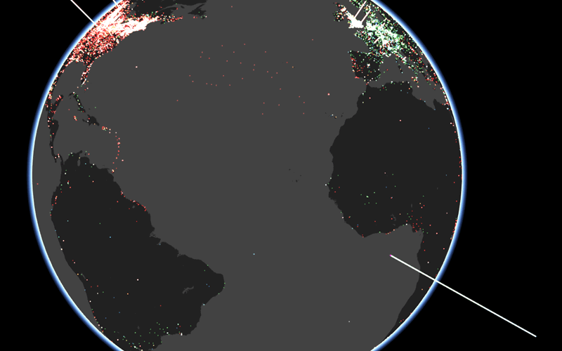

# PIC

By [Mauricio Giraldo](https://github.com/mgiraldo), [NYPL Labs](//twitter.com/nypl_labs)

## View at: [pic.nypl.org](http://pic.nypl.org)

See also the [PIC data repository](https://github.com/nypl/pic-data).



## Running

Populate `.env` from `env-sample`. Create a `config/database.yml` from `config/database-sample.yml`

```
foreman start
```

## License

Original code in this repository is released under [Creative Commons CC0 1.0 License](http://creativecommons.org/publicdomain/zero/1.0).

This repository includes:

- [CesiumJS](https://github.com/AnalyticalGraphicsInc/cesium/) which is released under the [Apache 2.0 license](http://www.apache.org/licenses/LICENSE-2.0.html).

- [Ruby on Rails](https://github.com/rails/rails) code which is released under the [MIT License](http://www.opensource.org/licenses/MIT).
